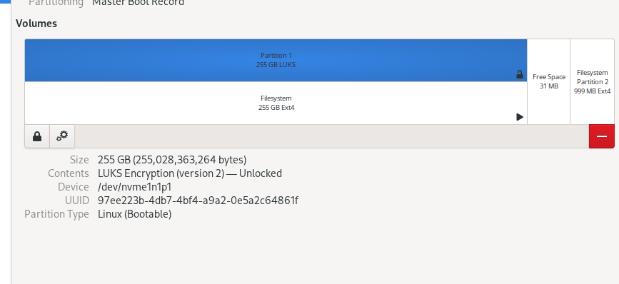
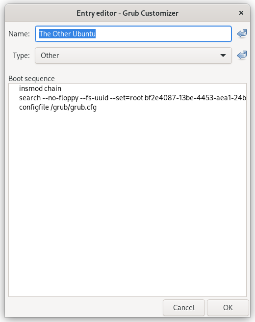

+++
title = 'Encrypting Existing Linux Installation'
date = 2022-11-01 23:38:50.325000
+++



I have an Arch (Gnome) on one physical disk and Ubuntu on another. At some point I decided to encrypt the Ubuntu installation.
Ubuntu was just sitting on a simple /dev/nvme1n1p1 partition. I added a separate boot /dev/nvme1n1p2 device to keep grub on, and it had its benefits too. Main bootloader lives on the Arch disk.

I followed the steps on Arch wiki, but during the boot there was no prompt to put password for decryption.

Ubuntu uses initramfs, Arch has mkinitcpio, I could not follow the HOOKS part on the wiki. I will describe what worked on Ubuntu.

 - I used Arch to mount the encrypted /dev/nvme1n1p1 device, in Gnome you can use the friendly Disks tool. Notice there are two UUIDs here - for the LUKS container and the actual rootfs. We will need the LUKS one, the second one is used inside /etc/fstab, which is read after the boot and is not related to the decrypting steps here:
 


- then as root in the terminal run arch-chroot on the mountpoint of the Ubuntu installation (if you are not on Arch, you will need to mount dev, proc and all that manually). I had to also perform PATH setting for some reason:

```bash
export PATH=/bin:/usr/local/sbin:/usr/sbin:/sbin:$PATH
```

- since the boot partition is separate from rootfs (I chose to not encrypt it), also mount it:

```bash
root@msi:/# mount /dev/nvme1n1p2 /boot
```

- Ubuntu provides update-initramfs script which will gather information from /etc/crypttab and /etc/fstab to be able to find your rootfs at boot. So you only have to put correct entries there:

```bash
root@msi:/# cat /etc/crypttab 
# <target name>	<source device>		<key file>	<options>
cryptroot UUID=97ee223b-4db7-4bf4-a9a2-0e5a2c64861f none luks

root@msi:/# cat /etc/fstab 
# /etc/fstab: static file system information.
#
# Use 'blkid' to print the universally unique identifier for a
# device; this may be used with UUID= as a more robust way to name devices
# that works even if disks are added and removed. See fstab(5).
#
# <file system> <mount point>   <type>  <options>       <dump>  <pass>
# / was on /dev/nvme0n1p1 during installation
UUID=4756df54-5536-4001-bc12-046572ed6bd1 /               ext4    errors=remount-ro 0       1
/swapfile                                 none            swap    sw              0       0
/dev/disk/by-uuid/bf2e4087-13be-4453-aea1-24b33b54b64a /boot auto nosuid,nodev,nofail,x-gvfs-show 0 0
```

- (optional) I also changed /etc/cryptsetup-initramfs/conf-hook, but probably that was not required:

```bash
root@msi:/# grep CRYPTSETUP /etc/cryptsetup-initramfs/conf-hook
# CRYPTSETUP: [ y | n ]
CRYPTSETUP=y
# Setting KEYFILE_PATTERN to a non-empty value implies "CRYPTSETUP=y".
```

- generate initramfs for the current kernel:

```bash
root@msi:/# update-initramfs -u
```

- now tell grub about that cryptroot entry (you can change the name if you do not like it):

```bash
root@msi:/# grep GRUB_CMDLINE_LINUX /etc/default/grub
GRUB_CMDLINE_LINUX_DEFAULT="quiet splash nvidia-drm.modeset=1 bluetooth.disable_ertm=1"
GRUB_CMDLINE_LINUX="cryptdevice=UUID=97ee223b-4db7-4bf4-a9a2-0e5a2c64861f:cryptroot root=/dev/mapper/cryptroot"
```

- update grub:

```bash
root@msi:/# update-grub
```

- done

### Helpful tips

I used a virtual machine on Arch to test Ubuntu installation ( Virtual Machine Manager is quite helpful). I used PCI passthrough to have the whole physical disk there. It is extremely handy to have that environment and I highly recommend doing that at all times (even on Windows with Hyper-V).

This way I was also able to test the second grub installation. Now even if Arch boot device dies, I still can go (hopefully) to Ubuntu because it has a separate boot partition. You can chain Arch's grub to Ubuntu's one like so:

```bash
       insmod chain
       search --no-floppy --fs-uuid --set=root bf2e4087-13be-4453-aea1-24b33b54b64a
       configfile /grub/grub.cfg
```

These are the directives for the grub config file, UUID is that of /dev/nvme1n1p2, where my second grub lives.

I used Grub Customizer on Arch to add another boot entry to its grub:



When grub loads misconfigured initramfs you drop into shell:

-picture of shell-

Sometimes it says what's up, sometimes not. If you type exit it will try to boot again and will hopefully show the error. In my case it could not find /dev/mapper/cryptroot that was declared as root by grub.

You can try to figure out what happens in initramfs to get you to your rootfs. I understood that it probably is not overly complicated. There is switch_root tool that is likely used at the very end of all when the rootfs is mounted and accessible. The device decryption happens with cryptsetup luksOpen. So once I ended up in the shell I ran this:

```bash
cryptsetup luksOpen /dev/nvme0n1p1 cryptroot
exit
```

And it immediately booted Ubuntu. Note that cryptsetup was not available until update-initramfs was able to see proper /etc/crypttab (or something similar that it relies on). I guess the equivalent configuration on Arch is done by mkinitcpio's HOOKS section.