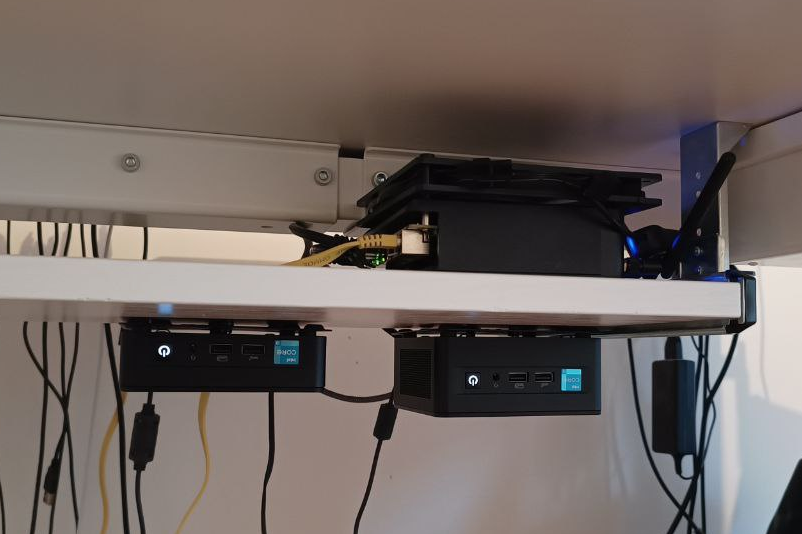
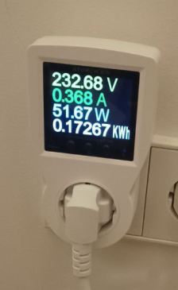
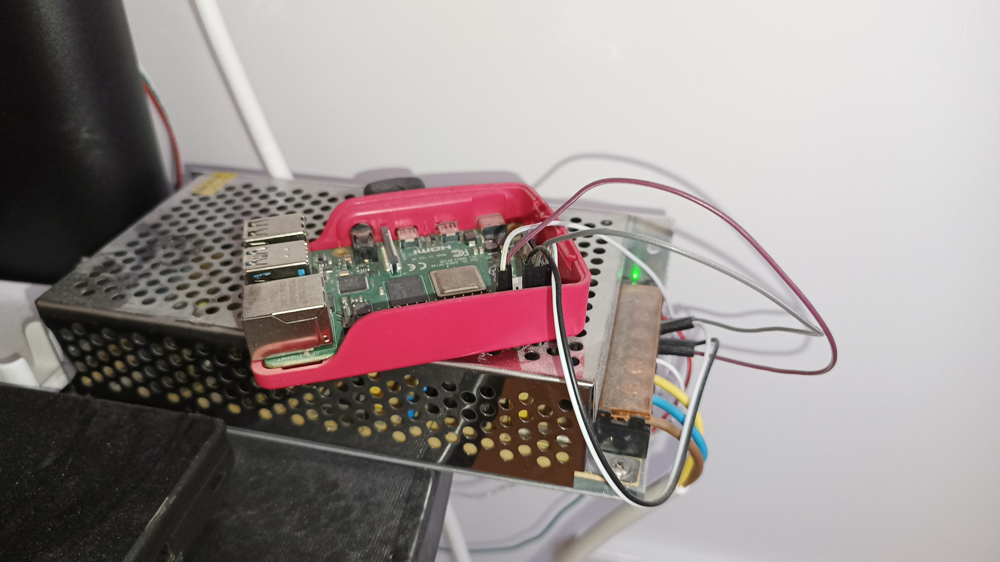

+++
title = 'Homelab'
date = 2024-03-08T18:01:38+01:00
+++

# Preface

I have been a loyal customer of Contabo for 5 years straight since 2018. They are a provider of the cheapest VPS in the world, mine was 4 CPU / 12 GB RAM / 300 GB SSD for about €9. There was even an update to the plan at some point where I could get 6 CPU / 16 GB RAM / 400 GB SSD for the same price, I just needed to pay them €25 to perform the "migration".

I worked as a "DevOps" guy at the time and was excited about all the tech. I used this VPS to run Gitlab, PowerDNS, Rocket.Chat, Jira, LDAP and a host of other things, all just to allow me to experiment with a "live" server.

Then I received an email from Contabo where they explain that "the effort required to perform repeated know-your-customer checks has reached such a point where it is no longer feasible for us to provide you with further services". Probably has to do with me being a Russian of course.

This was a good motivation for me to find another place to have a VPS. Sadly, there was no other provider of that class, the best you could get was 2 ARM CPU / 4 GB RAM for €4 at Hetzner.

So I thought maybe I could have a home lab instead, and expose it to the internet via a VPS. This approach has a few advantages:
- I am in control of my hardware, which allows me to upgrade it how I see fit for example. Plus a provider can no longer pull the €25 extortion trick just to expand a hard disk and restart my VM with more resources :)
- there is nothing substantial running on the VPS, only a VPN server where the lab connects to and a reverse proxy to publish services. So if I get evicted again I just go to another provider, order the cheapest VPS, bring up the VPN and the proxy, and I am back.
- I can have access to virtualization, attaching devices over USB and such.

And a couple of downsides of course:
- I am in control of my hardware, so if anything fails there I may potentially have a lot more headache.
- the computers will have to stay somewhere in the house, i.e. there most likely will be a new source of unwanted noise and changes to electricity bill.
- my choice of ISP can affect the quality of service of my self-hosted apps.

Obviously, for me it was exciting to have new hardware at home, so I did not pay a lot of attention to the downsides (apart from the noise one). This is what I bought at the end of 2023 - beginning of 2024:

node|CPU|RAM|DISK|NIC|cost|cost breakdown: base + boot disk + storage + RAM + WiFi + Fan
-|-|-|-|-|-|-
NUC 12 tall|i3|32|256 + 960|2.5G x1|€433|300 + 30 + 43 + 60 + 0 + 0
NUC 12|i3|32|256 + 960|2.5G x1|€499|340 + 25 + 74 + 60 + 0 + 0
Topton Firewall|N100|32|256 + 960|2.5G x4|€343|163 + 22 + 40 + 65 + 40 + 13

N100 heated its NVMe SSD up to 100°C during initial observations, so I put ARCTIC P14 Slim on top of it. This test was with Proxmox installed there, and now there is plain Debian running with not much going on. It shows 53°C and I am happy.

The plan was to run Proxmox on NUCs and use Ceph over 2.5G network. But then there was a [post on hacker news](https://fangpenlin.com/posts/2024/01/14/high-speed-usb4-mesh-network/) that promised even better performance. Luckily for me, the NUCs have 2 Thunderbolt 4 ports each, which may give me about 32 Gbps of bandwidth. This is 4 GB per second, which is roughly what an NVMe SSD has locally for sequential writes.

The N100 PC has several purposes:
- providing local network for NUCs, I use it for corosync and VM traffic
- establishing connection to the VPS and exposing VMs to it
- sharing routes to VMs with my laptop

I did not connect the machines my home network because they are far from the router and I do not want to even think about long cables :) I connected the NUCs to WiFi at first, but then realized they do not need it since N100 can serve as their own Internet gateway. Also, disabled WiFi cards should contribute to power saving and noise levels.

Now, please keep in mind that none of described configurations were applied from the first attempt. It is always a trial-and-error kind of process (plus lots googling and giving up), and what may look like a simple explanation is often a result of multiple failed designs. I even bought 1 NUC and N100 at first and ran them as Proxmox cluster with Ceph over 2.5G and corosync and VMs over WiFi (you'd better believe I put WiFi interface into a bridge, and also used IPv6 exclusively, haha! This sucked a lot, dear God)

# The setup

I use a standing desk for work, and I bought a tray for keyboard to store laptops when I do not need them. The NUCs need air to be able to stay quiet, so I tried to give them that:

There were VESA mounts included, so I used these and some electric tape to attach the NUCs upside down. It does not have a lot of style, but the PCs also do not get in my way, which is what I wanted to achieve.

Curiously, after writing this I now see that there was nothing stopping me from attaching the NUCs directly to the desk.

## Storage

I wanted to have an ability to quickly migrate VMs between the nodes, so used Ceph for storage. I know next to nothing about this software, but the UI configuration provided by Proxmox seemed to work well to get me started. At some point I wondered if I am getting good performance out of it, and this led me to try an [alternative](https://github.com/vitalif/vitastor). From what I understand, Ceph itself is the bottleneck when we are discussing performance, and it heavily depends on high-end hardware despite [multiple](https://docs.ceph.com/en/quincy/start/hardware-recommendations/) [places](https://pve.proxmox.com/wiki/Deploy_Hyper-Converged_Ceph_Cluster#chapter_pveceph) saying that it runs on commodity hardware. Vitaliy did an extraordinary job with vitastor, and also explained in detail how to run [benchmarks](https://yourcmc.ru/wiki/Ceph_performance). For some reason I could not get vitastor to work for me as it was showing the same write performance for processes with iodepth of 1 and more than 1 (even worse for the latter). I noticed this also during qcow2 imports, Ceph was a lot faster. This was sad as vitastor obliterated (up to 3 times faster) Ceph everywhere else (including writes with iodepth=1) and also promised to be lighter on the CPU.

I followed [this](https://gist.github.com/scyto/67fdc9a517faefa68f730f82d7fa3570) guide to get Thunderbolt network going. `iperf` reported a bandwidth of 20 Gbps. I wonder if I will have 10 Gbps like in the "mesh network" article if I add a third PC.

## Networking

There were two things I needed to setup:
- a cluster network for VMs, so that they can see each other from different Proxmox nodes
- ability to access the VMs from my laptop and from the VPS

The VLAN zone and some static routes would probably be sufficient now that I think about it. I went with EVPN, and configured a BGP controller to share routes with N100, which further shares them with the VPS and my laptop. That's right, I run frr / quagga on each machine, lol! I never had to work closely with a serious BGP device, but it turned out that it could be done without too much experience (thanks ChatGPT!).

Now I can have some VMs :)

## VMs

I remember I needed to configure proxy-pass directives on nginx by hand to expose the apps running on my VPS. I really did not want to have to do that again. I went with Kubernetes:
- it is super easy to expose web services
- I can get continuous practice with it while working as full-time developer, even though I now prefer to stay away from anything infra (because software development is a lot better than config file development)
- looks good on resume

(beware, too much k8s stuff)

So I made 1 VM for the control plane, and 2 worker VMs, all Debian imported from a cloud [qcow2](https://cloud.debian.org/images/cloud/bookworm/20240211-1654/debian-12-generic-amd64-20240211-1654.qcow2). I liked how cloud-init in Proxmox auto-expands the partition.

I used `kubeadm` to init the cluster, all the prerequisites like `containerd` were installed with `ansible`. I think next time I may try a distribution specifically built to be used with k8s. On the other hand, my new VPS also uses Debian, and I am to run an ingress controller there, so it was quite handy to reuse `ansible` roles to add it to the cluster.

In fact, I specifically wanted to describe **everything** I did to the machines through `ansible`. I even tried to use a Proxmox provider to create VMs via Terraform, but lost patience trying to configure it.

I then installed Calico for pod networking, at some point there was an idea to expose them through BGP but I never really needed that.

Finally, I needed a CSI implementation if any of my apps would have persistent data. I figured existing Ceph installation could be reused, especially since it works over a "fast" Thunderbolt connection. To achieve that I needed to add Thunderbolt interfaces to a bridge, and then connect all worker VMs to it. So far that works well. There was a case where EVPN would eagerly try to redistribute a route to that "storage" network via 2.5G cluster IP, and some VMs would fail to access Ceph monitors because the packets went to a wrong interface. Luckily, I have faith in `tcpdump` so was able to see the differences in packet handling between Proxmox nodes, which led me to see the rogue route. ChatGPT helped to create a BGP config, and after 2 days of trying to apply it I was able to filter the route (this again reminded me why I moved away from config development jobs).

## Apps

I went with Otomi at first to have an all-in-one pre-configured environment. I needed to change ssh endpoint for Gitea and broke it somehow. Then reset everything and added things manually step-by-step. But it was very useful to see what a developer platform could look like, so Otomi was helpful.

I installed `ingress-nginx` to be able to expose the apps locally. I wanted to have a `LoadBalancer` kind of services and `metallb` does the job fine. I gave it a range from the VM network so all the apps would appear to me as if they were just another VM.

I defined a `StorageClass` (just took a manifest from `ceph-csi` repository), and added an annotation to make it a default one for the cluster.

With that present, I installed Gitea from a helm chart. Its configuration is done via a `ConfigMap`, which is encrypted with base64. To edit it I used `k9s` with a custom shortcut kind folks shared [here](https://github.com/derailed/k9s/issues/1017).

Then I figured I would like to have `external-dns` to automatically create DNS records for `Ingress` resources. This made me install Pi-hole on the N100 machine, and now my laptop should also benefit from some ad blocking. The gateway router at home is provided by my ISP and it is not very configurable. I also did not yet make a decision to buy my own router that could organize my home network and abstract me from any future ISP, so this N100 machine is a first step in that direction :)

I added Authentik to be able to login to all my apps with the same credentials. Its integration with Gitea required usage of trusted certificates at some point. I started by adding my self-signed CA to all VMs.

Then figured I could use Let's Encrypt certificates once the VPS is able to host `Ingress` resources. So I installed a second `ingress-nginx` to the cluster, ordered certificates for publicly non-existing services and used them for my internal `Ingress` resources. This made Gitea and all the browsers happy.

I then setup some "GitOps" process with Argo CD to keep track of what I deploy to the cluster.

Finally, I wanted to host something for the public. There is a [fine free game](https://gitlab.com/glatteis/earthwalker) available, so I tried to [deploy](https://ew.pratclot.com/) it. I mirrored the repository with Gitea, configured a trigger for Tekton pipeline, setup a Harbor instance, wrote a kaniko pipeline and added a manifest for Argo to keep fresh code running. This required some intense config development, but I like the end result. Specifically, I like the complete CI/CD process at home that deploys something to the public while I sleep.

# Noise levels

The NUCs stay quiet when no VMs are running, otherwise they are really annoying :) For now I use:
```
cpupower frequency-set --max 1.5Ghz
```
and it keeps the fans near their lowest possible RPM setting. This is quite acceptable for a bedroom. As a bonus point, the same command helps me prolong battery life on my laptop!

I turned audio and WiFi off in BIOS to further help with the heating, but did not test how many watts that saves. Speaking of BIOS, the NUCs have I225-V for their 2.5G Ethernet which seems to be known for frustrating its users by not working :) The tall NUC did exactly that to me, and I was able to "fix" it by disabling some power management features in BIOS. Strangely, the "flat" NUC did not upset me like that. Neither did the N100 machine which has I226-V.

# Power consumption

I got an ATORCH tool from AliExpress, it reports 50W with 1.5 GHz limit and load average of 0-2, and can reach 100W without frequency limit:


Now that I have the number I could try to substitute all the power bricks with one. The NUCs need 19V and N100 works with 12V. I know as much about this stuff as I know about Ceph, so the plan is to buy a step-up converter for this 300W source, which was supposed to be a part of Ambilight-like system:


# Work in progress

Ceph cluster fails VMs every 2 days. It looks like `logrotate` restarts all Ceph processes once it processes the log files, and in the morning I wake up to see VMs failing to access their disks. `ceph status` says that everything is fine though. For now, I workaround it with `pkill -9 -f ceph` and `cron`:
```bash
/bin/sleep 60 && /usr/sbin/qm list | /usr/bin/awk '/kube/ {system("/usr/sbin/qm start "$1)}'
```
Maybe it will work better once I decide to get a third PC.

The connection between VPS and the control plane periodically dies for some reason:
```
# kubectl get po -n calico-system | grep calico-node
calico-node-9zdjn                          1/1     Running   7 (42h ago)        17d
calico-node-dv92q                          1/1     Running   7 (42h ago)        17d
calico-node-jxk47                          1/1     Running   7 (42h ago)        17d
calico-node-q4jkn                          1/1     Running   3037 (5m38s ago)   17d
```
