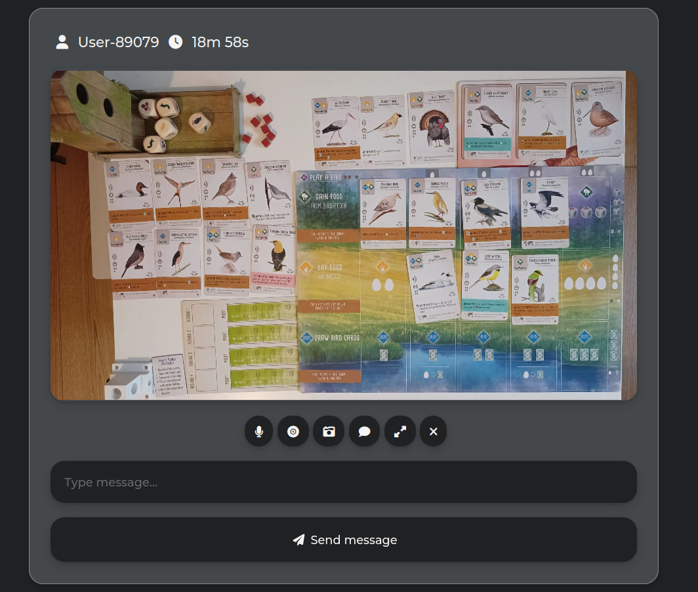

+++
title = 'Stream a Game of Wingspan'
date = 2024-12-02T14:04:12+01:00
draft = false
+++

This post is about a setup I use to play a physical version of a board game with my remote friend.

We played Wingspan down at the [BGA](https://boardgamearena.com/), then learned there were more birds added in expansions, but they were not available on the site. We were not ready to pay for [tabletopia](https://tabletopia.com/), and Steam version seemed to have unfriendly UI. On top of that, there was a desire to try a real version of the game given that I never had a board game in my life.

## How we play

Here is what it looks like for the viewer:



The server allows to zoom-in to see text "better":


## What it is made of

The setup for this is:

- [mirotalkbro](https://github.com/miroslavpejic85/mirotalkbro) to host streams in a browser
- [scrcpy](https://github.com/Genymobile/scrcpy) to capture game table with a phone
- Android phone with a 4k video recording support

This is how the phone is placed:


The cable connects it to computer, I believe it may use less battery compared to a wireless `adb` (plus slowly charge). You can use Android Studio to "automatically" connect to a wirelessly paired phone (just launch it and it will find the phone).

Here are the commands for a Linux machine to capture the stream:

```bash
# Mirotalk "requires" you to allow it to record both video and audio from your machine, so this is a user-end workaround to feed silence to it :)
sudo modprobe snd-dummy
# Add the dummy camera device
sudo modprobe v4l2loopback
# Listing available cams, need to identify the v4l2 one
v4l2-ctl --list-devices
# Now use /dev/video3 with scrcpy
scrcpy --camera-id=0 --video-source=camera --camera-fps=10 --camera-size=3840x2160 --no-audio --capture-orientation=180 --v4l2-sink=/dev/video3
```

I [tweaked](https://github.com/miroslavpejic85/mirotalkbro/compare/main...pratclot:mirotalkbro:hack-some-zoom) `mirotalkbro` a little to be able to zoom in where cursor is.

## Alternatives

Now, the `v4l2` cam is available to OBS too, so `mirotalk` technically is not even needed (you can stream to YouTube or Twitch directly). I did it because I like to self-host stuff, and could not get card text to be readable in Google Meet.

On the other hand, one can use a [sunshine](https://app.lizardbyte.dev/Sunshine/) + [moonlight](https://moonlight-stream.org/) combo to stream a 4k `scrcpy` window. 

## Conclusion

It seemed to be very important to have a 4k source video, otherwise the text would be blurry. I tried:

- a Full HD webcam
- running broadcast directly from an iPhone (because it would actually produce a 4k stream, but only in Safari :) Android phone sent a worse picture to the point of me thinking that it is not capable of a proper 4k)
- sharing a `scrcpy` window from the PC (works if the window is on a 4k display)

Overall, I am very happy that this cheap setup can deliver a great experience. Many thanks to `scrcpy` creators, it is one of the tools that makes Android a better choice than an iPhone.
